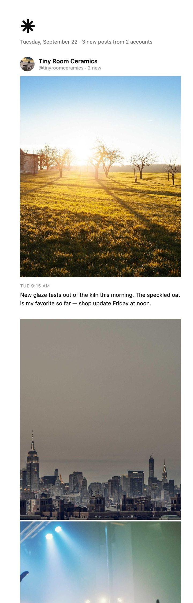

# ⁕ Epilog

**A daily email of new posts from the Instagram accounts you choose, so you can keep up without opening the app.**

Every morning, Epilog sends you one calm email with what your chosen accounts posted: the photos, full captions, every image in multi-photo posts, and a link to watch videos in the app. It runs on your own computer, uses Instagram's official API, and sends from your own Gmail. Nothing else is involved.

<p align="center"></p>

Free and open source (MIT). Made by [Kara Valdon](https://karavaldon.com/epilog).

---

## What it can and can't do

- ✅ Posts, multi-photo posts and Reels from **Business and Creator accounts**, which covers most brands, shops, artists, musicians, publications and public figures
- ✅ Add or remove accounts by **replying to any Epilog email**
- ❌ **Personal accounts.** Instagram's API doesn't allow reading them. Epilog tells you which accounts on your list are personal.
- ❌ Stories, and anything that would need scraping. Epilog only uses Instagram's official API, so it doesn't break Instagram's terms or put your account at risk.

## What you'll need

- **A Mac or Linux computer.** It needs to be awake at delivery time; if it's asleep, the digest arrives when it wakes.
- **An Instagram account switched to Creator or Business.** This is free, and you can switch back later.
- **A Facebook Page linked to that Instagram account.** A placeholder Page is fine; nobody needs to see it.
- **A free Meta developer account**, to create a small personal app
- **Gmail** with 2-Step Verification turned on

Setup takes **20–30 minutes** the first time. Most of that is on Meta's website, and the setup assistant walks you through each step.

## Install

### Mac

1. **[Download Epilog](https://github.com/karavaldon/epilog/archive/refs/heads/main.zip)** and unzip it. Move the folder somewhere permanent, like your Documents folder, because Epilog runs from wherever the folder is.
2. Open the folder and double-click **Setup Epilog**.
   > The first time, macOS may say it "can't be opened because it is from an unidentified developer." Right-click (or Control-click) **Setup Epilog**, choose **Open**, then **Open** again.
3. Follow the steps in the Terminal window.

### Linux, or if you prefer the terminal

```sh
git clone https://github.com/karavaldon/epilog.git
cd epilog
./setup.sh
```

## What setup does

1. **Connect Instagram.** It explains how to make your account professional, link a Page, create a Meta app and generate a token, and can open each page for you. Then it checks the connection works.
2. **Connect Gmail.** You create an app password: a separate password just for Epilog, which you can revoke anytime. Epilog sends from your Gmail to yourself and reads your replies to its emails.
3. **Choose a delivery time.** It schedules the daily digest, plus a check for your replies every 15 minutes.
4. **Pick accounts.** You get a welcome email. Reply with the handles you want to follow, one per line. Within about 15 minutes you'll get a confirmation, followed by a first digest of the past week.

You can stop and restart setup anytime; it remembers finished steps.

## Using Epilog

**Adding and removing accounts:** reply to any Epilog email.

```
@yourfavoritebakery
a.local.gallery
remove @someone.else
```

One handle per line, with or without the @. Profile links work too, and so does `add @handle`. You'll get a reply confirming what changed.

**Renewing the Instagram connection:** Meta's connection lasts about 60 days. A week before it expires, your digest will remind you. To renew, run setup again (double-click **Setup Epilog**). It takes about 2 minutes, because you only need a fresh token.

**Changing the delivery time:** run setup again.

**Other commands.** Run these from the Epilog folder in Terminal:

| Command | What it does |
|---|---|
| `uv run epilog status` | Shows what's connected and scheduled |
| `uv run epilog check` | Shows which of your accounts Instagram's API can read |
| `uv run epilog run --dry-run` | Builds today's digest as a web page, without sending it |
| `uv run epilog demo` | Previews the email design with sample posts |
| `uv run epilog schedule uninstall` | Stops the daily email |

## Privacy

Everything runs on your computer. Your Instagram token and Gmail app password are stored in a `.env` file in the Epilog folder, readable only by your user account. Epilog only talks to Instagram's API, the image links Instagram returns, and your Gmail. There's no server, no analytics and no account with anyone else.

## Troubleshooting

- **"Gmail didn't accept that address and app password".** App passwords only work for the Google account that created them. Check which account you were signed in as, then create a fresh one.
- **"No Facebook Page with a linked Instagram account was found".** Make sure your Instagram is a Business or Creator account and is linked to a Facebook Page, and that you selected that Page when generating the token.
- **The digest didn't arrive.** Your computer may have been asleep or off at delivery time; it'll send when it wakes. Logs are in the `logs` folder, and `uv run epilog status` shows the last send.
- **An account shows as "not available".** It's a personal account, or the username has changed.
- **Windows** isn't supported yet.

## Uninstalling

1. Run `uv run epilog schedule uninstall`, then delete the Epilog folder.
2. Revoke the app password at [myaccount.google.com/apppasswords](https://myaccount.google.com/apppasswords).
3. Optionally, delete the Meta app at [developers.facebook.com/apps](https://developers.facebook.com/apps).

## License

MIT. See [LICENSE](LICENSE).
